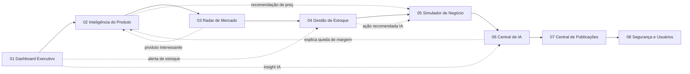

# Fluxo de navegação — OmniSync AI

Princípio de UX do produto: **dados → interpretação → recomendação → ação controlada**.
Fluxo recomendado de implementação e de uso: Dashboard → Produto → Mercado → Estoque → Simulação → IA → Publicação → Segurança.

## Mapa de rotas (React Router v6)

| Rota | Tela | Seção do menu |
|---|---|---|
| `/dashboard` | Dashboard Executivo | Operação |
| `/produto-intel` | Inteligência do Produto | Operação |
| `/radar-mercado` | Radar de Mercado | Inteligência |
| `/estoque` | Gestão de Estoque | Operação |
| `/simulador` | Simulador de Negócio | Inteligência |
| `/central-ia` | Central de IA | Inteligência |
| `/publicacoes` | Central de Publicações | Marketing & Social |
| `/seguranca` | Segurança e Usuários | Configurações |
| `/` | redirect para `/dashboard` | — |
| `*` | 404 simples com botão "Voltar ao Dashboard" | — |

Implementar com `<Routes>` dentro de `App.jsx`, todas as rotas filhas de um `<Route element={<AppShell />}>` (layout compartilhado).
