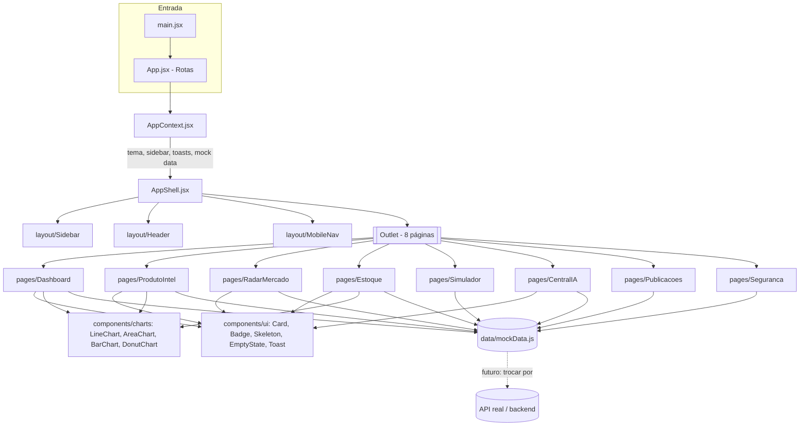

# Diagrama de arquitetura — componentes e dados

## Camadas e responsabilidades

- **`AppContext.jsx`**: única fonte de estado global — tema (light/dark, persistido em `localStorage`... **exceto se este código rodar como artifact de preview, nesse caso usar estado em memória**; em projeto Vite normal, `localStorage` é permitido), estado da sidebar/menu mobile, fila de toasts, e os dados mockados carregados uma vez.
- **`components/ui`**: componentes "burros", sem lógica de negócio — recebem props e renderizam.
- **`components/charts`**: encapsulam o Recharts, recebem `data` e `theme` via props, para as páginas não conhecerem detalhes do Recharts diretamente.
- **`pages/*`**: montam o layout específico da tela, buscam os dados de `mockData.js` (ou futuramente de um hook `useApi`), e decidem loading/empty/erro.
- **`data/mockData.js`**: isolado de propósito — no dia de plugar um backend real (Supabase, conforme a visão de produto), só essa camada muda, nenhuma página precisa ser reescrita.

## Evolução futura (fora do escopo deste protótipo, mas a arquitetura já prevê)
- Trocar `mockData.js` por um hook `useApi`/`useSWR` apontando para Supabase (mencionado na visão de produto como destino de implementação).
- Cada agente de IA da Central de IA hoje é só um card estático — no futuro corresponde a um serviço/rota de backend separado.
